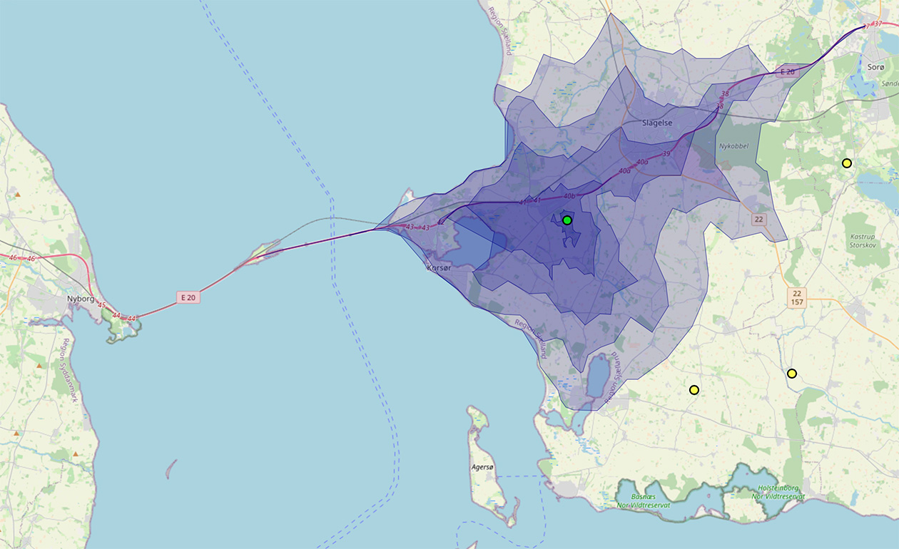

# Learning GIS and PostGIS


This project visualizes Danish shelters and their accessibility on an interactive map. Select a shelter to display isochrone zones showing up to 15 minutes of travel time. The map uses OpenStreetMap data and Leaflet, with all routing and analysis computed using PostGIS and pgRouting.

This is a personal project for learning GIS and PostGIS.




## What's needed

- PostgreSQL with PostGIS and pgRouting  
  (Easiest: use the `kartoza/postgis` Docker image)
- A road shapefile for Denmark (OSM)
- Shelter data (included as `data/shelters.gpkg`)
- Enough RAM & disk (increase Docker shared memory to 1GB: `--shm-size=1g`)

## Data sources

- Open Street Map shapefiles for Denmark can be downloaded from [geofabrik.de](https://download.geofabrik.de/europe.html)
- Shelters can be retrieved from udinaturen.dk by QGIS using `data/udinaturen_shelters.py`

## Reproduce the process

1. **Load OSM roads into PostGIS**  

```sh
ogr2ogr -f "PostgreSQL" PG:"<pg conn string>" -nln roads gis_osm_roads_free_1.shp
```

3. **Add shelters data**  

```sh
ogr2ogr -f "PostgreSQL" PG:"<pg conn string>" shelters.gpkg -nln shelters -t_srs EPSG:4326
```


4. **Prepare the network and compute isochrones**  
Run the included SQL scripts in order:
- `sql/1-init_roads.sql` (adjust schema, add cost fields, etc.)
- `sql/2-split_roads_at_intersections.sql` (fix intersections for routing)
- `sql/3-build_network.sql` (create routing topology)
- `sql/4-compute_shelter_isochrones.sql` (calculate drive-time areas)

> **Note:** When running the isochrone calculation, consider splitting the work into several batches (one per CPU core) — Postgres uses only one core per process, so this makes a huge difference for 400+ shelters.

5. **Serve to the web map**  
Use `api.php` (see code) to serve GeoJSON layers to the map.

6. **View results**  
Open `map.html` to see shelters and their isochrone polygons (by drive time).

